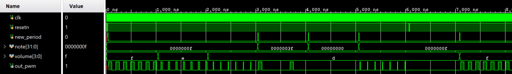

# freq_pwm

## Testbench Validation
- Initial reset
- Lowering volume
    - `100% volume` (50% duty-cycle) @ `0x0F` clocks per period
    - `50% volume` (25% duty-cycle) @ `0x0F` clocks per period
    - `25% volume` (12.5% duty-cycle) @ `0x0F` clocks per period
- Changing frequency
    - `25% volume` (12.5% duty-cycle) @ `0x3F` clocks per period
- Setting frequency to 0
    - `No output` @ `0x00` clocks per period
    - `25% volume` (12.5% duty-cycle) @ `0x0F` clocks per period
` Reset
    - `No output` until `new_period`
- Regain frequency
    - `100% volume` (50% duty-cycle) @ `0x0F` clocks per period
